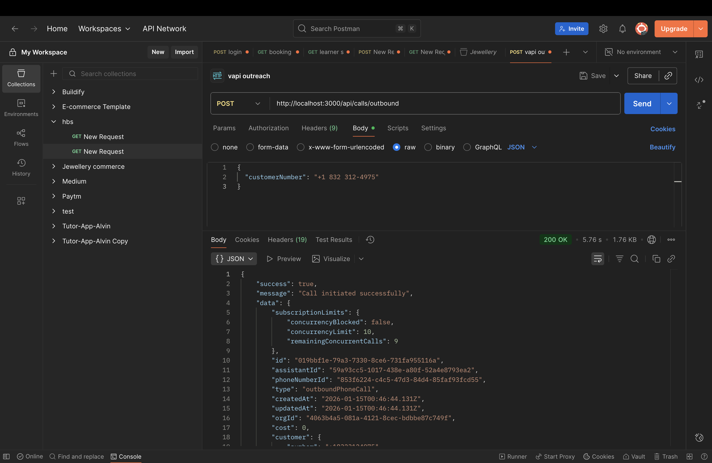
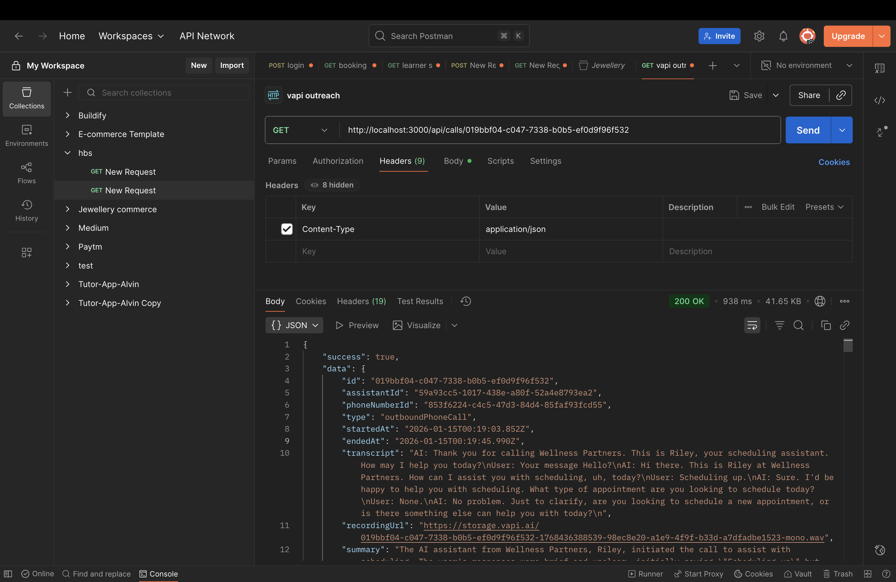
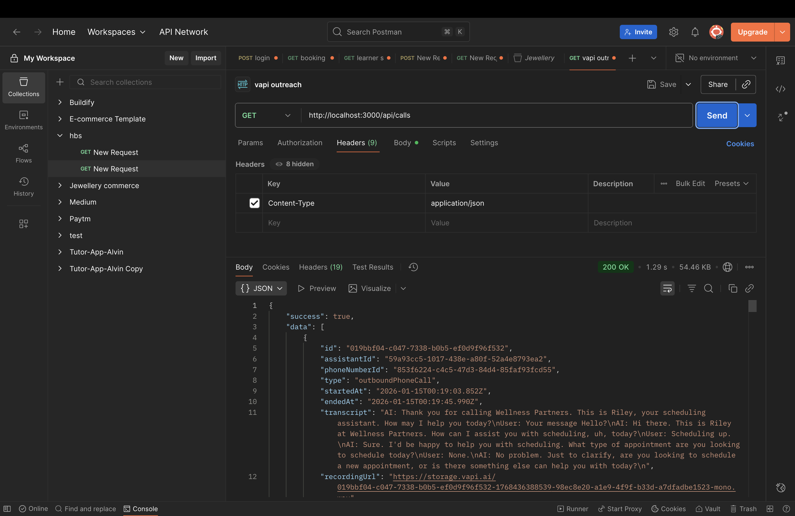

# 📞 VAPI Outreach Call Agent

AI-powered automated outbound calling system built with TypeScript and VAPI.

## 🚀 Features

- ✅ Make automated outbound calls with AI assistants
- ✅ Track call status and details in real-time
- ✅ Webhook support for call events
- ✅ RESTful API with TypeScript
- ✅ Built-in health monitoring
- ✅ Comprehensive error handling

## 📋 Prerequisites

- Node.js (v16 or higher)
- VAPI account with API credentials
- Configured AI assistant in VAPI dashboard
- Phone number provisioned in VAPI

## 🛠️ Setup

### 1. Install Dependencies
```bash
npm install
```

### 2. Configure Environment Variables

Create a `.env` file in the root directory:

```env
# VAPI Configuration
VAPI_TOKEN=your_vapi_api_token_here
ASSISTANT_ID=your_assistant_id_here
PHONE_NUMBER_ID=your_phone_number_id_here

# Server Configuration
PORT=3000
```

**How to get these values:**
- **VAPI_TOKEN**: Get from [VAPI Dashboard](https://vapi.ai) → Settings → API Keys
- **ASSISTANT_ID**: Create an assistant in VAPI Dashboard → Copy the ID
- **PHONE_NUMBER_ID**: Purchase/configure a phone number in VAPI → Copy the ID

### 3. Run the Application

**Development Mode** (with hot reload):
```bash
npm run dev
```

**Production Mode**:
```bash
# Build TypeScript to JavaScript
npm run build

# Start the server
npm start
```

The server will start on `http://localhost:3000`

## 📡 API Endpoints

### 🏠 Base & Health

#### Get API Information
```http
GET /api
```

**Response:**
```json
{
  "name": "VAPI Outreach Call API",
  "version": "1.0.0",
  "endpoints": { ... }
}
```

#### Health Check
```http
GET /api/health
```

**Response:**
```json
{
  "status": "healthy",
  "timestamp": "2026-01-15T01:44:08.123Z",
  "uptime": 123.456
}
```

---

### 📞 Call Management

#### Make Outbound Call
```http
POST /api/calls/outbound
Content-Type: application/json

{
  "customerNumber": "+919876543210"
}
```

**Response:**
```json
{
  "success": true,
  "message": "Call initiated successfully",
  "data": {
    "id": "call_abc123",
    "status": "queued",
    "customer": { "number": "+919876543210" }
  }
}
```

#### Get Call Status
```http
GET /api/calls/status/:callId
```

**Response:**
```json
{
  "success": true,
  "callId": "call_abc123",
  "status": "ended",
  "startedAt": "2026-01-15T01:00:00Z",
  "endedAt": "2026-01-15T01:05:30Z",
  "duration": 330,
  "cost": 0.15,
  "phoneNumber": "+919876543210"
}
```

#### Get Call Details
```http
GET /api/calls/:callId
```

**Response:**
```json
{
  "success": true,
  "data": { /* Full call object from VAPI */ }
}
```

#### List All Calls
```http
GET /api/calls
```

**Response:**
```json
{
  "success": true,
  "data": [ /* Array of call objects */ ]
}
```

---

### 🔔 Webhooks

#### Call Status Webhook
```http
POST /api/webhooks/call-status
```

Receives call status updates from VAPI.

#### Assistant Message Webhook
```http
POST /api/webhooks/assistant-message
```

Receives assistant messages during calls.

## 🧪 Testing the API

### Using cURL

**Make a test call:**
```bash
curl -X POST http://localhost:3000/api/calls/outbound \
  -H "Content-Type: application/json" \
  -d '{"customerNumber": "+1234567890"}'
```

**Check call status:**
```bash
curl http://localhost:3000/api/calls/status/YOUR_CALL_ID
```

### Using Postman or Thunder Client

Import the following endpoints:
- Base URL: `http://localhost:3000`
- Use the endpoints documented above

## 📁 Project Structure

```
VAPI Outreach calls/
├── src/
│   ├── routes/
│   │   ├── calls.ts       # Call management routes
│   │   ├── webhooks.ts    # Webhook handlers
│   │   └── index.ts       # API info & health
│   └── server.ts          # Express server setup
├── dist/                  # Compiled JavaScript (generated)
├── .env                   # Environment variables (create this)
├── .env.example           # Environment template
├── package.json
├── tsconfig.json          # TypeScript configuration
└── README.md
```

## 🔧 Tech Stack

- **Runtime**: Node.js
- **Language**: TypeScript
- **Framework**: Express.js
- **HTTP Client**: Axios
- **Security**: Helmet, CORS
- **Dev Tools**: tsx (TypeScript execution)

## ⚠️ Important Notes

- **Real Calls = Real Costs**: Each API call to `/api/calls/outbound` will make an actual phone call and charge your VAPI account
- **Phone Format**: Use E.164 format (e.g., `+1234567890`)
- **Rate Limiting**: Consider implementing rate limiting for production use
- **Testing**: Always test with your own phone number first

## 🐛 Troubleshooting

**Server won't start:**
- Check if port 3000 is already in use
- Verify all environment variables are set in `.env`

**Calls not working:**
- Verify VAPI credentials are correct
- Check VAPI dashboard for assistant and phone number configuration
- Ensure phone number is in E.164 format

**TypeScript errors:**
- Run `npm install` to ensure all dependencies are installed
- Check `tsconfig.json` configuration

## 📸 Screenshots

### Outbound Call


### Call Details


### All Calls


## 📄 License

ISC

## 🤝 Contributing

Feel free to submit issues and enhancement requests!

---

**Built with ❤️ using VAPI and TypeScript**
